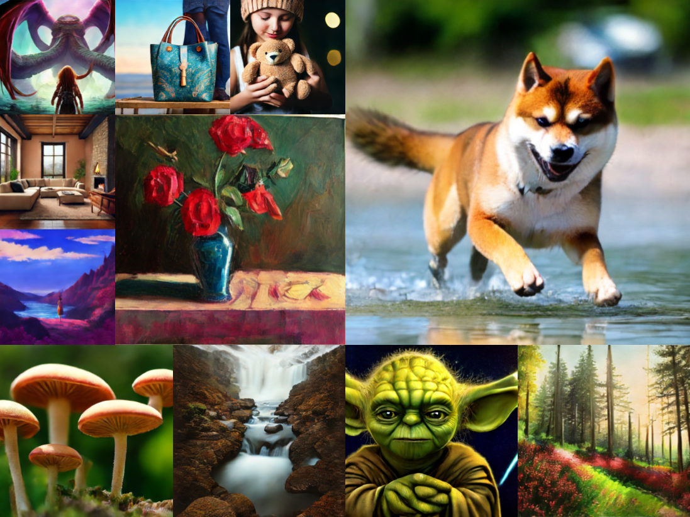

##### Table of contents
1. [Environment Setup](#environment-setup)
2. [How to Run](#how-to-run)
3. [Acknowledgments](#acknowledgments)
4. [Note](#note)
5. [License](#license)
6. [Contacts](#contacts)

# Official PyTorch code of "SwiftBrush: One-Step Text-to-Image Diffusion Model with Variational Score Distillation" (CVPR'24)
<a href="https://arxiv.org/abs/2312.05239"></a>
<a href="https://thuanz123.github.io/swiftbrush"></a>
<a href="https://swiftbrushv2.github.io"></a>
<div align="center">
  <a href="https://thuanz123.github.io" target="_blank">Thuan&nbsp;Hoang&nbsp;Nguyen</a> &emsp;
  <a href="https://scholar.google.com/citations?user=FYZ5ODQAAAAJ&hl=en" target="_blank">Anh&nbsp;Tran</a>
  <br> <br>
  
  
  <a href="https://www.vinai.io/">VinAI Research</a>
</div>
<br>

<div align="center">
    
</div>

> **Abstract**: Despite their ability to generate high-resolution and diverse images from text prompts, text-to-image diffusion models often suffer from slow iterative sampling processes. Model distillation is one of the most effective directions to accelerate these models. However, previous distillation methods fail to retain the generation quality while requiring a significant amount of images for training, either from real data or synthetically generated by the teacher model. In response to this limitation, we present a novel image-free distillation scheme named **SwiftBrush**. Drawing inspiration from text-to-3D synthesis, in which a 3D neural radiance field that aligns with the input prompt can be obtained from a 2D text-to-image diffusion prior via a specialized loss without the use of any 3D data ground-truth, our approach re-purposes that same loss for distilling a pretrained multi-step text-to-image model to a student network that can generate high-fidelity images with just a single inference step. In spite of its simplicity, our model stands as one of the first one-step text-to-image generators that can produce images of comparable quality to Stable Diffusion without reliance on any training image data. Remarkably, SwiftBrush achieves an FID score of **16.67** and a CLIP score of **0.29** on the COCO-30K benchmark, achieving competitive results or even substantially surpassing existing state-of-the-art distillation techniques.

**TLDR**: An image-free distillation method that transform multi-step text-to-image diffusion models into one-step generators.

Details of algorithms and experimental results can be found in [our following paper](https://arxiv.org/abs/2312.05239):
```bibtex
@InProceedings{nguyen2024swiftbrush,
  title={SwiftBrush: One-Step Text-to-Image Diffusion Model with Variational Score Distillation},
  author={Thuan Hoang Nguyen and Anh Tran},
  booktitle = {Proceedings of the IEEE/CVF Conference on Computer Vision and Pattern Recognition (CVPR)},
  year={2024}
}
```
**Please CITE** our paper whenever this repository is used to help produce published results or incorporated into other software.

## Environment Setup

Before running the scripts, make sure to install the library's training dependencies:

Navigate to the swiftbrush folder and setup the conda environment 
```bash
cd swiftbrush
conda install -n swiftbrush python=3.10
```

Then activate the conda environment and install all dependencies 
```bash
conda activate swiftbrush
pip install -r requirements.txt
```

(Optional) install xformers using the guide from [here](https://github.com/facebookresearch/xformers#installing-xformers)

And finally initialize an [🤗Accelerate](https://github.com/huggingface/accelerate/) environment with:

```bash
accelerate config
```

Or for a default accelerate configuration without answering questions about your environment

```bash
accelerate config default
```

## How to Run

### Training
First prepare your own `.txt` file containing all the prompts for training and pre-generate the text embeddings to save training time. Running the below command will create a text embeddings folder with the same name as the `.txt` file

```bash
python prepare.py \
  --pretrained_model_name_or_path "stabilityai/stable-diffusion-2-1-base" \
  --prompt_list "/path/to/txt_file" \
  --batch_size 32 \
  --num_processes 16
```

To train a SwiftBrush model, simply run:

```bash
accelerate launch train_swiftbrush.py \
  --pretrained_model_name_or_path "stabilityai/stable-diffusion-2-1-base" \
  --train_data_dir "/path/to/text_embeddings_folder" \
  --resolution 512 \
  --use_ema \
  --validation_prompts "A racoon wearing formal clothes, wearing a tophat. Oil painting in the style of Rembrandt" "a zoomed out DSLR photo of a hippo biting through a watermelon" "a lanky tall alien on a romantic date at italian restaurant with a smiling woman, nice restaurant, photography, bokeh" \
  --validation_steps 500 \
  --train_batch_size 16 \
  --gradient_accumulation_steps 1 \
  --set_grads_to_none \
  --guidance_scale 4.5 \
  --learning_rate 1.e-06 \
  --learning_rate_lora 1.e-03 \
  --lr_scheduler "constant" --lr_warmup_steps 0 \
  --lora_rank 64 --lora_alpha 108 \
  --num_train_epochs 3 \
  --checkpointing_steps 10000
```

For low-memory GPU, you can add `--enable_xformers_memory_efficient_attention` (xformers must be installed) and/or `--gradient_checkpoint` arguments to the above command

### Inference

To generate an image, simply run:

```bash
python infer.py \
  --pretrained_model_name_or_path "thuanz123/swiftbrush" \
  --prompt "A DSLR photo of a shiba on the beach" \
  --seed 0
```

## Acknowledgments
We give thanks to Uy Dieu Tran for early discussions as well as providing many helpful comments and suggestions throughout the project. Special thanks to Trung Tuan Dao for valuable feedback and support. Last but not least, we thank Zhengyi Wang, Cheng Lu, Yikai Wang, Fan Bao, Chongxuan Li, Hang Su and Jun Zhu for the work of ProlificDreamer as well as Huggingface team for the diffusers framework.

## Note

We have also been developing a superior version, **SwiftBrush v2**, and a brief introduction of its is available [here](https://swiftbrushv2.github.io/).

## License
```
Copyright (c) 2024 VinAI
Licensed under the Creative Commons Attribution Non Commercial 4.0 International.
You may obtain a copy of the License at
    https://creativecommons.org/licenses/by-nc/4.0/
```

## Contacts
If you have any questions, please drop an email to _v.thuannh5@vinai.io_ or open an issue in this repository.
